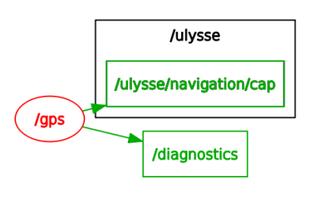

GNSS Package
=======

Package ROS permettant de calculer le cap à partir de deux GNSS et d'envoyer les trames en UDP.

Architecture de dossiers
---

	ublox_gps
	├── LOGS
	│   └── GNSS_DATA
	└── src
	    ├── ublox_ZED-F9H.py
	    └── ublox_manual_head_cumputing.py

* **LOGS/**: Fichiers log 
	* **GNSS_DATA/**: Fichiers contenant les trames NMEA et la trame HDT calculée.
* **src/**:
	* `ublox_ZED-F9H.py`: Script diffusant le cap avec un GNSS ublox-ZED-F9H et les trames avec un ublox-ZED-F9P.
	* `ublox_manual_head_cumputing.py`: Script calculant le cap à partir de deux GNSS ublox-ZED-F9P.

Node ROS
---

Seul le node ROS utilisant les deux GNSS ZED-F9P a été testé et est utilisé.

Se lance avec `rosrun`:

	$ rosrun ublox_gps ublox_manual_head_cumputing.py

Lance le node `gps` qui donne le status du node (temps de calcul et cap calculé) dans le topic `/diagnostics`. L'information du cap est également transmise dans le topic `/ulysse/navigation/cap`.

Configuration sur Ulysse - 2 ZED-F9P
-----

Les trames sont envoyées en UDP Broadcast `10.255.255.255` sur le port `1010`.

* **1. Branchement NUC-17**

**GPS AV**: `/dev/ttyACM1` bd=`115200`

**GPS AR**: `/dev/ttyACM0` bd=`115200`

* **2. RTKlib - Depuis station sol**

**Via `strsvr_qt`**:

	* TCP_client: `193.52.45.41` - port `2534`
	* Outputs configurés sur GPS AV et GPS ARR

**Via `str2str`**:

	str2str -in tcpcli://193.52.45.41:2534 -out serial://ttyACM1:115200:7:N:1:off -out serial://ttyACM0:115200:7:N:1:off

* **3. Checker si les trames sont bien envoyées sur le réseau**

~~~~
sudo netcat -l -k -u 10.255.255.255 1010 
~~~~